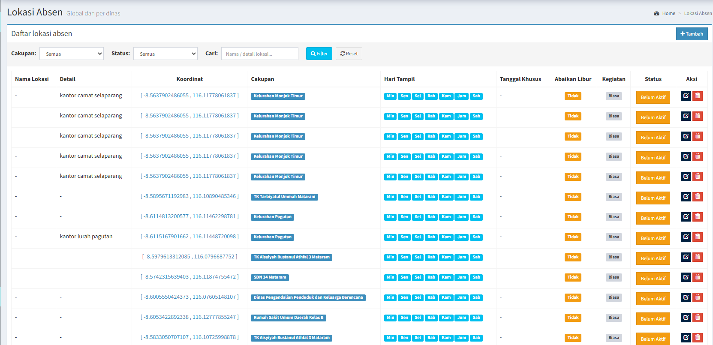

# Laporan Bukti Dukung SKP: Pengembangan SIMPEG BKPSDM Kota Mataram & Rekapitulasi TPP
**Periode:** Juni - 2026
**Status:** Selesai (100%)

---

## 1. Identitas Rencana Hasil Kerja (RHK)
- **RHK Utama**: Terlaksananya pengelolaan sistem informasi
- **Indikator**: Jumlah pengelolaan sistem informasi

- **RHK Tambahan**: Terlaksananya rekapitulasi presensi online dan rekap TPP.
- **Indikator**: Tingkat pengelolaan rekapitulasi presensi online dan rekap TPP

## 2. Ruang Lingkup Pekerjaan
Penyusunan Tambahan Penghasilan Pegawai di BKPSDM rutin setiap bulan:
*   **Rekapitulasi Presensi Pegawai**: Melakukan penyesuain dokumen TPP yang didasarkan pada tingkat kehadiran pegawai, komponen tunjangan disiplin.
*   **Sinkronisasi Nilai SKP**: Sinkronisasi nilai SKP Ekinerja pegawai untuk komponen prestasi kerja.
*   **Menambah fitur untuk Lokasi Absen**: Penambaham fitur Lokasi Absen yang lebih fleksibel dan dinamis

## 3. Detail Teknis (Evidence)

| Komponen | Teknologi | Status |
| :--- | :--- | :--- |
| Aplikasi | Simpeg Kota Mataram & Ekinerja | Teroptimasi |
| Data | Presensi & Nilai Ekinerja | 100% |
| Bulan Ke- | 6 (Juni)| Selesai |

### Dokumentasi Progres 
Aktivitas pekerjaan dapat diakses pada dokumentasi tangkapan layar.

## 4. Tampilan Visual (Screenshot)
*Berikut adalah tampilan antarmuka yang telah diimplementasikan:*

> *Keterangan: Tampilan pengerjaan TPP bulan Maret.*

## 5. Kendala dan Solusi
- **Kendala**: Terdapat bug pada fitur Lokasi Absen
- **Solusi**: Aplikasi sudah berjalan dengan optimal dan fitur sudah dapat digunakan

---
*Dibuat oleh:*
**LALU ACHMAD WIRAHARLAN, S.KOM**
NIP. 199901072022031005
