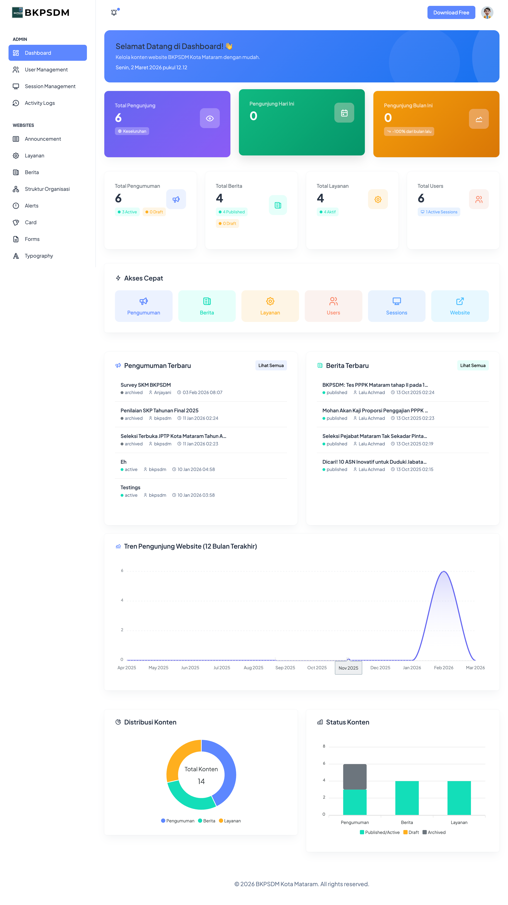

# Laporan Bukti Dukung SKP: Pengembangan Website BKPSDM
**Periode:** Februari - 2026
**Status:** Selesai (100%)

---

## 1. Identitas Rencana Hasil Kerja (RHK)
- **RHK Utama**: Terlaksananya Pengelolaan Sistem Informasi.
- **Indikator**: Jumlah pengelolaan sistem informasi.

## 2. Ruang Lingkup Pekerjaan
Pengembangan website [BKPSDM](https://github.com) mencakup beberapa modul utama:
*   **Modul Berita & Informasi**: Integrasi CMS untuk pembaruan pengumuman kedinasan.
*   **Optimasi Database**: Peningkatan kecepatan akses data pegawai melalui query optimization.

## 3. Detail Teknis (Evidence)

| Komponen | Teknologi | Status |
| :--- | :--- | :--- |
| Frontend | Bootstrap 5 / Golang Template | Deploy |
| Backend | Golang / Fiber | Aktif |
| Database | MySQL| Teroptimasi |

### Dokumentasi Progres (Commit History)
Aktivitas pengembangan dapat diverifikasi melalui commit [private]

## 4. Tampilan Visual (Screenshot)
*Berikut adalah tampilan antarmuka yang telah diimplementasikan:*
!(./assets/landing.png)

> *Keterangan: Tampilan dashboard admin untuk pengelolaan data pegawai.*

## 5. Kendala dan Solusi
- **Kendala**: Migrasi data lama dari format Excel ke database SQL.
- **Solusi**: Membuat script migrasi otomatis menggunakan Python untuk meminimalisir kesalahan input.

---
*Dibuat oleh:*
**LALU ACHMAD WIRAHARLAN,S.KOM**  
NIP. 199901072022031005
